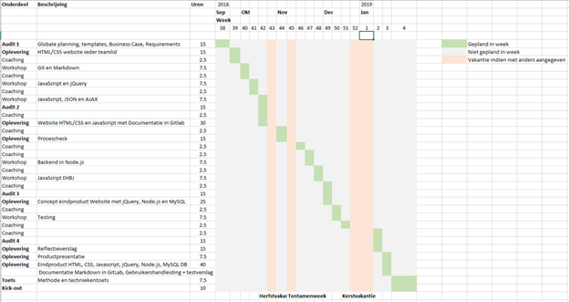
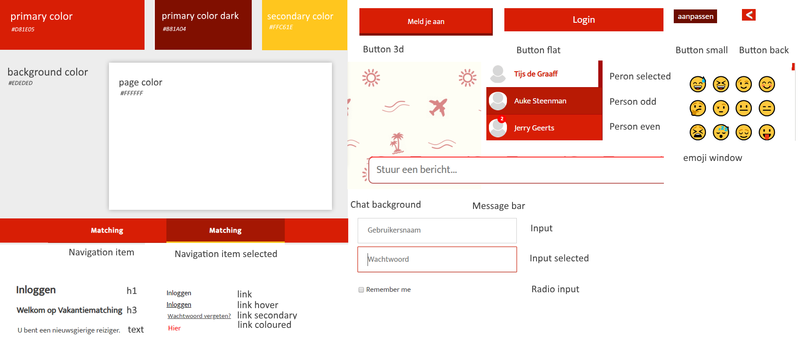
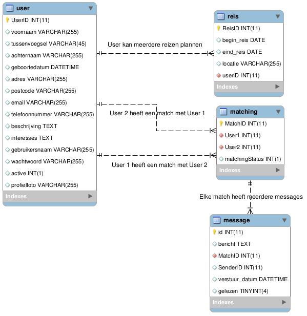

# Corendon Reisbuddy

## Index:

[Technical specs](#technical-specs)

[Instructies](#instructies)

[Businesscase](#businesscase)
* [Aanleiding](#-aanleiding)
* [Aanpak](#-aanpak)
* [Verwachte resultaten](#-verwachte-resultaten)
* [Aanleiding](#-risicos)
* [Alternatieven](#-alternatieven)
* [Globale planning](#-globale-planning)
* [Bron vermelding](#-bron-vermelding)

[MoSCoW Tabel](#-moscow-tabel)

[Style guide](#-style-guide)

[Testing](#-testing)

[DB Model](#-database)

======

##### Technieken gebruikt in deze versie van website zijn:

* HTML5 (Te vinden in de `client/Views` folder, hier staan alle webpagina's.)
* Css4 (Te vinden in de `client/Resources/Css` folder, hier staan alle css componenten die worden aangesproken in de templates.)
* JavaScript (Front-end user interaction, creërt dynamische webpagina's.)
* JQuery (Library voor css functionaliteit en animatie in javascript.)
* Node (Javascript gebaseerde server, maakt onder andere connectie met de database.)
* Express (Transformeert de server naar een REST api. Connect naar url en krijg json terug.)
* JWT (Json web token, een json authenticatie cookie om user op zowel font en backend op te verifiëren.)
* BCrypt (Gebruikt om wachtwoorden te hashen en salten in de database.)
* Socket.io (Gebruikt om real time chat mogelijk te maken tussen gebruikers)

## Instructies:

Om gebruik te maken van ons project heb je een aantal dingen nodig:

* Een terminal (Het liefst unix based, maar CMD werkt ook.)
* npm (Node package manager.)
* node.js (Javascript server)
* xampp

1. Clone het project naar de `htdocs` folder in de xampp map.
2. Open de terminal.
3. Navigeer naar de folder waar je het project naar toe hebt gekloont.
4. Navigeer naar de folder `fys-is106-2/server`.
5. Voer het command `npm install` uit.
6. Voer in deze directory het commando `npm run dev-server` uit.

#### terminal

Als je windows gebruikt kun je [http://cmder.net/](hier) een geschikte console emulator vinden.

#### node

Hier te vinden: https://nodejs.org/en/

#### npm

Hier te vinden: https://www.npmjs.com/

#### xampp

https://www.apachefriends.org/index.html

## Businesscase:

### :low_brightness: Aanleiding

Zeventig jaar geleden telde Nederland 285.000 alleenstaanden, inmiddels zijn dat er meer
dan drie miljoen uit deze cijfers kunt u zien dat het aantal hard stijgt. In de vakantiewereld is er een groeiende vraag naar reizen voor alleenstaanden.
Corendon wilt op deze ontwikkeling inspelen en wil de alleenstaande reizigers met elkaar in contact brengen op basis van gezamenlijke interesses.

### :wrench: Aanpak

Team 2 zal tijdens de span van een halfjaar een webapplicatie bouwen die ondersteund zal worden op een aantal van de
mainstream browsers. Deze webapplicatie zal gebruikt worden door de klanten van het reisbureau Corendon.

Team 2 begint met het verzamelen en documenteren van hun acties en geplande acties. Nadat dit vastgelegd en verzameld is
zal de website gebouwd worden. Dit zal op een gestructureerde manier in zijn werk gaan met de stappen uit de geleverde
documentatie.
Nadat de applicatie gereed is voor commercieel gebruik zullen er medewerkers van Corendon gevraagd worden om het programma
leren te gebruiken en te onderhouden.

### :bar_chart: Verwachte resultaten

Aan het eind van het project zullen deze resultaten verwacht worden:
1. :newspaper: Een web applicatie met de volgende pagina’s:
  * [x] Een introductie pagina.
  * [x] Een pagina met samenwerkings afspraken.
  * [x] Resposive zijn voor smartphones en tablets.
  * [x] Interesses kunnen categoriseren.

2. :busts_in_silhouette: gebruiker mogelijkheden:
  * [x] Een gebruiker moet zich kunnen registreren.
  * [x] Een gebruiker moet kunnen inloggen.
  * [x] Een gebruiker moet zijn gegevens kunnen wijzigen.
  * [x] Een gebruiker moet zijn gegevens kunnen verwijderen.
  * [x] Een gebruiker moet zijn gegevens kunnen inzien op een profielpagina.
  * [x] Een gebruiker moet kunnen matchen met andere gebruikers op basis van locatie en interesses.
  * [x] Een gebruiker moet kunnen praten met deze matches D.M.V. een ingebouwd chat systeem.
  * [x] Een profielfoto kunnen uploaden. - Een groep kunnen aanmaken om met meerder gebruikers in contact te komen.

### :cloud: Risico's

De belangrijkste risico’s dat team2 tijdens het project kan tegenkomen

Een merge conflict met de service “Git”.
Een merge conflict onstaat als 2 of meer mensen een bestand tegelijkertijd proberen te proberen te pushen naar de branch. 
Als dit tegelijkertijd gebeurd weet git niet meer welk bestand hij moet gebruiken en komt er een conflict. Een risico kan 
zijn dat iemand dit automatisch laat oplossen en dat git belangrijke code overschrijft en zo de applicatie onstabiel maakt. 
Dit kan het beste opgelost worden als de mensen die het merge conflict veroorzaakt hebben gezamenlijk besluiten wat weg moet 
en wat moet blijven.

Een ernstige beveiligingsfout wat kan leiden tot “Datadiefstal”.
Team 2 is een groep studenten die net aan de opleiding Software Engineering zijn begonnen. Dit betekent dat ze op bepaalde 
vlaktes redelijk veel kennis missen. Dit kan leiden tot een fout bij bijvoorbeeld het inloggen van een gebruiker. Hierdoor 
kunnen er gegevens gestolen worden door criminelen. Dit kan voorkomen worden door goed op te letten bij de informatie lessen
en meteen bij twijfel vragen stellen bij een leidinggevende.

Met elkaar in conflict dat kan eindigen in minder voortgang.
Team2 zijn een aantal fanatieke programmeurs. Met fanatiek gedrag komt koppigheid gepaard. Dit kan leiden tot conflicten 
waardoor bepaalde onderdelen niet afgemaakt kunnen worden. Of het ergste scenario, dat één van de teamleden het team verlaat.
Dit kan voorkomen worden door naar beide partijen te kijken en kijken welke oplossing het best past bij het probleem door voor 
en nadelen op te schrijven.

Verlies van lokale data die niet al gecommit was in git.
Omdat er lokaal gewerkt wordt aan bestanden is er natuurlijk een kans dat lokale machines het begeven voordat de bestanden zijn
opgeslagen en gestuurd zijn naar de server. Een voorbeeld hier bij kan zijn: Teamlid 1 probeert een lastige functionaliteit toe 
te voegen hier is hij/ zij al 5 dagen mee bezig. Maar heeft het nog niet gecommit aan de server. Dan uit het niets valt zijn laptop
uit en na een aantal uur ziet hij dat zijn harde schijf schrijffouten maakt, Het bestand waar hij zolang mee bezig was geweest kan
niet meer gebruikt worden en hij moet overnieuw beginnen. Dit kan voorkomen worden door regelmatig de lokale hardware te checken 
op fouten of kwalen. En elke dag zijn voortgang uploaden naar bijvoorbeeld een “testbranche”.

### :bookmark_tabs: Alternatieven 

Layout wijkt af van de huidge Corendon website.

voordelen
* Team 2 heeft meer flexibiliteit qwa het ontwerpen van de website.
nadelen
* Het is natuurlijk mooier als een child site van Corendon ook het design heeft van Corendon 

### :roller_coaster: Globale planning 

### :globe_with_meridians: Bron vermelding 

[Voorbeeld Businesscase](https://vlo.informatica.hva.nl/courses/1000PFYS18/document/Software-Engineering/Workshops/Workshop-1-Requirements-Business-Case-Interview/FYS-SE-BusinessCase_Voorbeeld.pdf?cidReq=1000PFYS18&id_session=0&gidReq=0&gradebook=0&origin) is gebruikt om dit document te maken.

## :notebook_with_decorative_cover: MoSCoW tabel:

Prioriteit | Requirement
---------- | -----------
Must have | Aanmaken van Gebruiker.
Must have | Bewerken van een Gebruiker.
Must have | Verwijderen van een gebruiker.
Must have | Inzien van een gebruiker. (profiel pagina)
Must have | Gebruiker moet interesses kunnen kiezen.
Must have | Intresses moeten aangemaakt kunnen worden (door admin of door gebruiker zelf)
Must have | Gebruikers moeten met elkaar kunnen matchen. (op basis van locatie en intresses)
Must have | Gebruikers kunnen na het matchen met elkaar in contact komen middels een chat.
Should Have	| Gebruiker moet het wachtwoord kunnen resetten
Should Have	| Notificaties (bijv. bij het matchen van 2 gebruikers)
Should Have	| Categoriseren van intresses.
Should Have	| Gebruikers kunnen kiezen uit intresses en locaties.
Should Have	| Gebruiker kan profielfoto toevoegen.
Could have | Responsive op mobile en tablet.
Could have | Locatie uitlezen van gebruiker (middels API google chrome)
Could have | Gebruikers groepen.

## :rainbow: Style guide

## :bookmark_tabs: Testing

# System Test
Hieronder volgen de test cases die beschikbaar zijn voor een System Test van de website. 
System Tests worden uitgevoerd om te garanderen dat de website in zijn geheel naar behoren functioneert en zijn daarom zeer gedetailleerd uitgewerkt, inclusief alternatieve scenario's waar nodig.

### ST_001 - Gebruiker registreren

**Type**: System test  
**Prioriteit**: Hoog  
**Preconditie**: Geen  

| Stap | Omschrijving | Verwacht resultaat |
|-|-|-|
| 1 | Klik op de knop “meld je aan” | Website toont een pop-up met een formulier voor het invullen van je gegevens. |
| 2 | Vul het formulier in en klik op de knop “Registreren” | Website sluit de pop-up en registreert hiermee de gebruiker. |

### ST_002 - Gebruiker inloggen

**Type**: System test  
**Prioriteit**: Hoog  
**Preconditie**: ST_001 - Gebruiker registeren  

| Stap | Omschrijving | Verwacht resultaat |
|-|-|-|
| 1 | Klik op de knop “inloggen” | Website toont een pop-up met een formulier voor het invullen van je login gegevens. |
| 2 | Vul het formulier in en klik op de knop “Login” | Website logt de gebruiker in en brengt je naar de homepagina met menu. |

### ST_003 - Profielpagina inzien

**Type**: System test  
**Prioriteit**: Hoog  
**Preconditie**: ST_002 - Gebruiker inloggen  

| Stap | Omschrijving | Verwacht resultaat |
|-|-|-|
| 1 | Klik op de menu tab “mijn profiel” | De gegevens van de gebruiker worden getoond en zijn correct als beschreven in testscenario ST_001 – gebruiker registreren. |

### ST_004 - Matching

**Type**: System test  
**Prioriteit**: Hoog  
**Preconditie**: ST_002 - Gebruiker inloggen  

| Stap | Omschrijving | Verwacht resultaat |
|-|-|-|
| 1 | Klik op de menu tab Zoeken” | De gebruiker ziet een scherm met personen met keuzes om met deze personen te matchen. |
| 2 | Zoek een persoon klik op de check | De persoon verdwijnt uit de lijst en verschijnt in je open chats. |
| 4 | Kijk of de gematchte persoon uit de lijst verdwijnt | De gematchte persoon is uit de lijst verwijderd en heeft hiermee een match verzoek gekregen. |

### ST_005 - Uitloggen

**Type**: System test  
**Prioriteit**: Laag  
**Preconditie**: ST_002 - Gebruiker inloggen  

| Stap | Omschrijving | Verwacht resultaat |
|-|-|-|
| 1 | Klik op de knop “Uitloggen” | De pagina herlaad en de gebruiker de gebruiker krijgt nu de optie om zichzelf weer in te loggen |

## :monkey_face: Testing results

### 31/12 2018
**Uitgevoerd door:** Rob Roy

| Test Case ID | Test Case Titel / Extensie Titel | Pass / Fail |  Fail Stap | Fail Opmerking |
|-|-|-|-|-|
| ST_001 | Gebruiker registreren | pass | - | - |
| ST_002 | Gebruiker inloggen | pass | - | - |
| ST_003 | Profielpagina inzien | pass | - | - |
| ST_004 | Matching | fail | stap 1 | JSon parser zorgt ervoor dat matching crasht. |
| ST_005 | Uitloggen | pass | - | - |

### 07/01 2019
**Uitgevoerd door:** Tijs de Graaff

| Test Case ID | Test Case Titel / Extensie Titel | Pass / Fail |  Fail Stap | Fail Opmerking |
|-|-|-|-|-|
| ST_001 | Gebruiker registreren | pass | - | - |
| ST_002 | Gebruiker inloggen | pass | - | - |
| ST_003 | Profielpagina inzien | pass | - | - |
| ST_004 | Matching | fail | stap 1 | JSon parser zorgt ervoor dat matching crasht. |
| ST_005 | Uitloggen | pass | - | - |

### 14/01 2019
**Uitgevoerd door:** Jerry Geerts

| Test Case ID | Test Case Titel / Extensie Titel | Pass / Fail |  Fail Stap | Fail Opmerking |
|-|-|-|-|-|
| ST_001 | Gebruiker registreren | pass | - | - |
| ST_002 | Gebruiker inloggen | pass | - | - |
| ST_003 | Profielpagina inzien | pass | - | - |
| ST_004 | Matching | pass | - | - |s
| ST_005 | Uitloggen | pass | - | - |

## :link: Database

[Database model mwb](server/fys_db_model_14-01-2019.mwb)

# fys-is106-2 | 5 harrys

